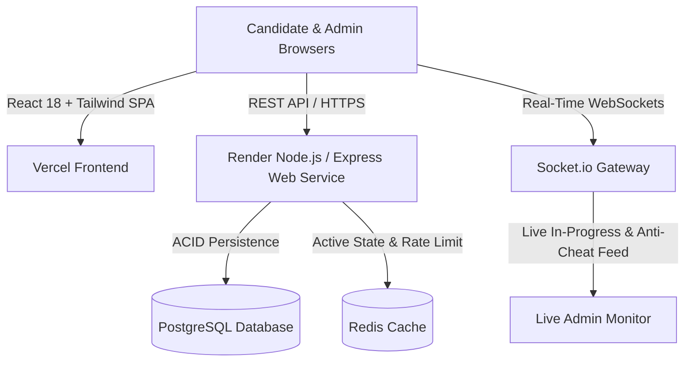

# Aptitude Test Platform (Thinqloud VQAR)
> **Session-Based Campus Placement Screening System**  
> *Author: Paras Jagadish Patil (`paras.jagadish.patil@gmail.com`) · Version 1.0.0*

[](https://vercel.com/new/clone?repository-url=https://github.com/Paras2611/thinqloudApti&project-name=aptitude-test-frontend&env=VITE_API_URL,VITE_APP_NAME,VITE_SOCKET_URL&envDescription=Backend+API+URL+from+Render+deployment)
[](https://render.com/deploy?repo=https://github.com/Paras2611/thinqloudApti)

---

## 🚀 Overview

The **Aptitude Test Platform** is an enterprise-grade, session-based campus recruitment testing suite designed specifically to mirror company-administered screening tests (featuring Thinqloud's **VQAR: Quantitative, Logical, Verbal, and Grammar** format). 

It features real-time proctor audit logging, automated timer synchronization, server-side scoring (with zero credential/answer leakage to client browsers), live WebSocket invigilation, and instant CSV/PDF export.

---

## 🏛️ System Architecture



---

## 🔑 Default Seed Credentials

Upon first server start, the system automatically provisions the root administrator:

| Attribute | Seed Value |
|---|---|
| **Email** | `paras.jagadish.patil@gmail.com` |
| **Password** | `2@*****` *(hashed with bcrypt, cost factor 12)* |
| **Role** | `SYSTEM_ADMIN` |
| **Demo Candidate** | `candidate.demo@thinqloud.com` / `Demo@123` *(Roll: `TQ-2026-001`)* |
| **Pre-Seeded Mock Session** | `Thinqloud Campus Placement Screening Mock - Batch 2026` *(Access Code: `THINQ6`)* |

> ⚠️ **Security Notice:** Change the admin password upon initial deployment.

---

## ⚡ Tech Stack

- **Frontend**: React 18, Vite, Tailwind CSS 3.x, React Router v6, KaTeX (LaTeX math), Socket.io Client, Lucide Icons, jsPDF.
- **Backend**: Node.js 20 LTS, Express 4.x, Socket.io 4.x, bcryptjs, jsonwebtoken (httpOnly strict cookies), Multer, csv-parse, Helmet, express-rate-limit.
- **Data Engine**: PostgreSQL (Production) / Pure-JS ACID storage engine (Local dev), Redis support.
- **Deployment**: Vercel (`vercel.json`), Render (`render.yaml`), GitHub Actions CI/CD.

---

## 💻 Local Quickstart

### 1. Start the Backend API
```bash
cd backend
npm install
node src/seed.js    # Pre-seeds admin and 29 VQAR questions
npm start           # Runs on http://localhost:5000
```

### 2. Start the Frontend Application
```bash
cd frontend
npm install
npm run dev         # Runs on http://localhost:5173
```

Navigate to `http://localhost:5173` to access both the Candidate Portal and System Admin Console.

---

## ☁️ Step-by-Step Cloud Deployment

### Step 1: Fork Repository
Fork this repository to your GitHub account.

### Step 2: Deploy Backend to Render
Click the **Deploy to Render** button above. Render reads `render.yaml` to provision:
1. `aptitude-api` Web Service
2. `aptitude-db` PostgreSQL database
3. `aptitude-redis` Redis cache

### Step 3: Deploy Frontend to Vercel
Click the **Deploy with Vercel** button above:
- Set `VITE_API_URL` to your Render API URL (e.g., `https://aptitude-api.onrender.com`).
- Set `VITE_SOCKET_URL` to `wss://aptitude-api.onrender.com`.

### Step 4: Configure CORS on Render
In the Render dashboard under `aptitude-api` environment variables:
- Set `FRONTEND_URL` to your Vercel deployment URL (e.g., `https://aptitude-test.vercel.app`).
- Trigger a re-deploy for the new CORS setting to take effect.

---

## 📋 PRD Feature Matrix

- [x] **VQAR 4-Section Test Pattern**: Quantitative, Logical, Verbal, Grammar.
- [x] **Mathematical Formula Rendering**: Native KaTeX LaTeX math support (`$formula$`).
- [x] **Strict Timer Synchronizer**: Turn amber at 10m, red at 5m, auto-submits within 5s of 0:00.
- [x] **Continuous Auto-Save**: Candidate choices recorded idempotently per click without manual save button.
- [x] **Proctor Audit Watchdog**: Detects tab/window defocusing (`visibilitychange`), records `TAB_SWITCH`, alerts candidate after 3 switches.
- [x] **Live WebSocket Monitor**: Real-time connected counts, in-progress count, submissions, and flag alerts.
- [x] **Question Bank Management**: Full CRUD, CSV bulk import with downloadable template, preview modal.
- [x] **Cohort Management**: Candidate roster, individual and bulk CSV enrollment, password resets.
- [x] **Reporting & Analytics**: Real-time leaderboard, section accuracy charts, CSV & PDF score cards.
